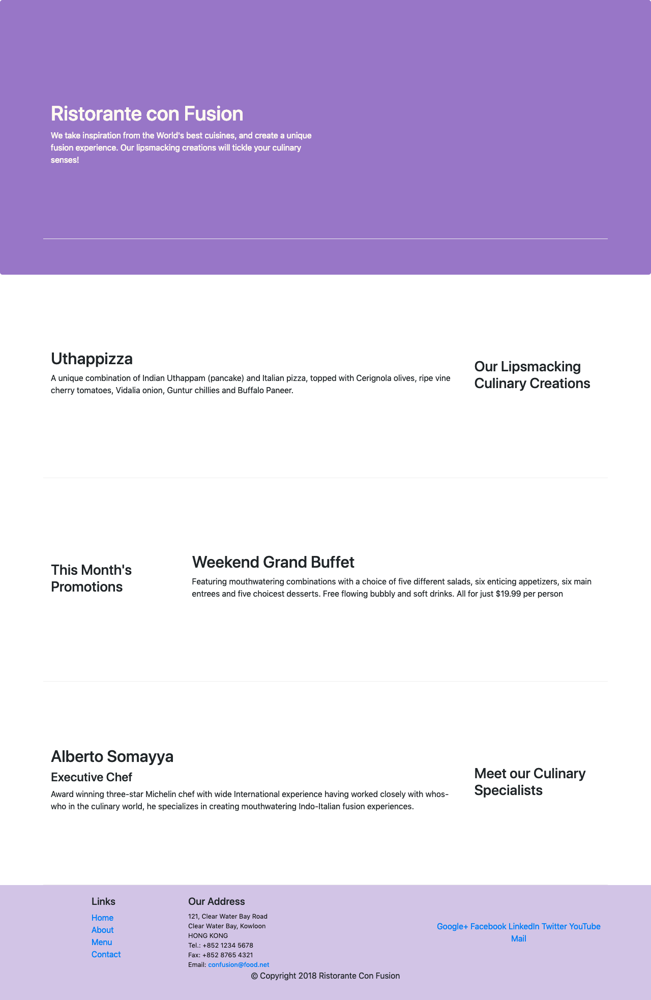

# conFusion
This is the Project built using Bootstrap as part of a Full stack Web Development (Frontend Frameworks) specialisation offered by Hongkong University of Science & Technology through Coursera.

# Technologies Used
* Bootstrap
* jQuery
* HTML, CSS & JavaScript
* Grunt & Gulp - Task runners

# Screenshots

